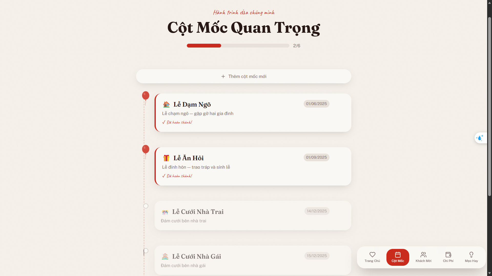
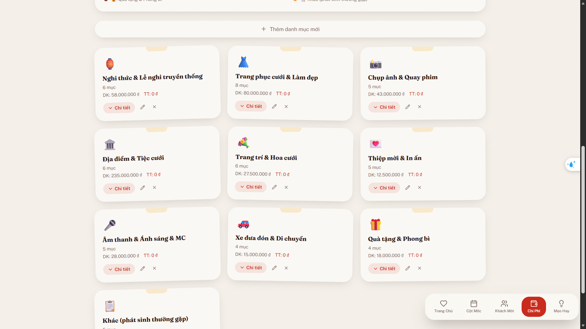
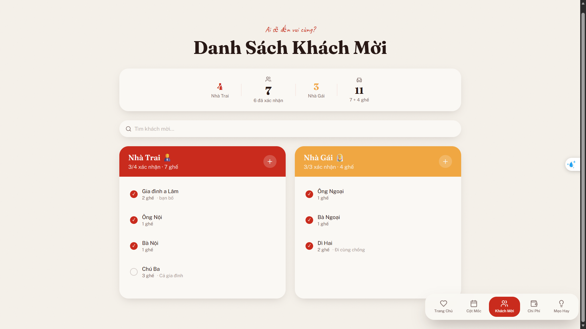
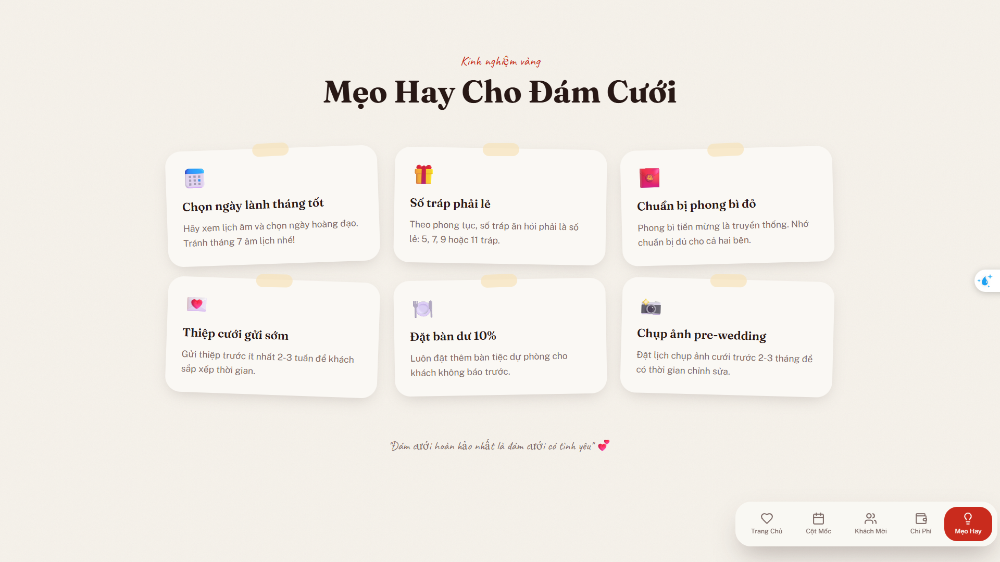
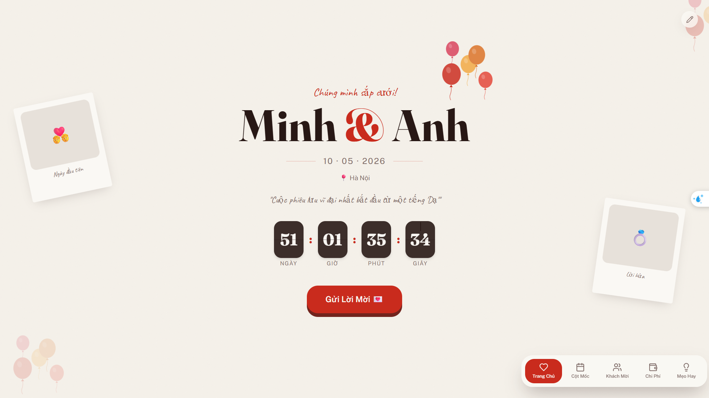

# Happy Wedding

## Happy Wedding - Plan wedding and send invitations

### Summary

Happy Wedding is a full-featured wedding planning app with an intuitive UI for couples. Manage wedding milestones, expenses by category, and guest invitations from both sides of the family in a single place.

### Tech stack

- React + TypeScript
- Vite
- Tailwind CSS
- Radix UI / component library (custom UI components)
- API layer for guest management/queries

### Features

- Milestone tracking for wedding preparation steps

- Expense planner with multiple categories, budgeting and charts

- Guest list management for both bride-side and groom-side attendees

- Useful small tips about wedding for our lovely couples 

- Cozy hero page where you can send to your friends

### Setup

1. Clone repo
   - `git clone <repo-url>`
2. Enter directory
   - `cd your-love-story-planner`
3. Install
   - `npm install`
4. Run dev server
   - `npm run dev`
5. Build
   - `npm run build`
6. Test
   - `npm run test`

### Quick access

- Quick access via deploy link: `https://happy-wedding-gules.vercel.app`
(This deployment may not contain any dynamic actions.
For actual data manipulations, see branch api-integration)

- Backend repo: `https://github.com/Gloxiniaaa/HappyWedding.Api`
### Credit: 
Lovable AI 